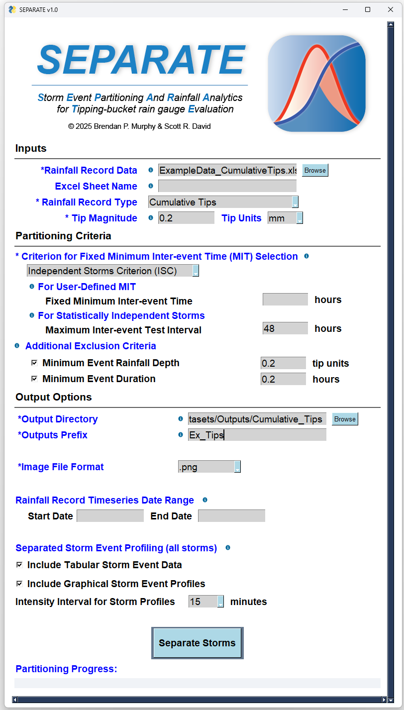

# SEPARATE

  

## Example Datasets

To help users get started quickly, we include two example datasets:
| Filename                             | Description                                                                 |
|--------------------------------------|-----------------------------------------------------------------------------|
| `ExampleData_FixedInterval.xlsx`    | Example dataset logged at regular intervals using fixed time steps.      |
| `ExampleData_CumulativeTips.xlsx`   | Example dataset with cumulative tip logging style (e.g., HOBO loggers).  |

Each file contains two columns:
1. **Timestamp** in the format `MM/DD/YY HH:MM:SS`
2. **Rainfall Value** — either:
   - Cumulative tip count (`Cumulative Tips` format), or
   - Rainfall per interval (`Fixed Interval` format)

Both files are preformatted to match SEPARATE’s input requirements. You can use them to test the interface, explore SEPARATE’s options, or verify that your installation is working correctly. For more information about rain gauge data types, GUI parameter selection, and underlying data processing methods, see the Supplement [hyperlink to pdf] or our detailed Instruction Manual [../SEPARATE-User-Manual-Version1.0.pdf]

The [`ExampleOutputs`](./ExampleOutputs) folder contains results from running both datasets (named accordingly) using a 15-minute duration storm intensity for plotting.

  
   
  <em>Figure: Fixed interval usage example.</em>

 

  
   
  <em>Figure: Cumulative tips usage example.</em>

