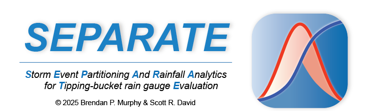

# SEPARATE


<p align="center">
  
</p>

## Overview
**Storm Event Partitioning And Rainfall Analytics for Tipping-bucket rain gauge data Evaluation (SEPARATE)**

SEPARATE is an open-source, GUI-based software package that provides users with a fast, reliable, and automated method to post-process tipping bucket rain gauge (TBRG) data. It enables the identification and partitioning of independent storm events and calculates key rainfall metrics like storm duration, magnitude, and intensity. SEPARATE supports both user-defined and statistical (independent storm criterion) approaches to event separation, while offering a range of tabular and graphical output options.

The software is distributed both as:
- A **standalone executable** (no Python installation needed)
- A **source code version** with environment files for Python users

 SEPARATE was developed using PySimpleGUI, compiled into a standalone executable with PyInstaller, and packaged using Inno Setup for distribution.

## Download & Installation

SEPARATE can be used in two ways:

---

### 🔹 Option 1: Precompiled Installer (Recommended)

A precompiled Windows installer is available [here] ([https://your-download-link.com](https://usu.box.com/v/SEPARATE-download)) *(link to be added)*. This version includes all required dependencies and does **not** require Python to be installed.

**Steps:**
1. Download `SEPARATE_setup.exe` from xyz site.
2. Run the installer and follow the prompts.
3. Launch SEPARATE from the desktop shortcut or Start Menu.

> ⚠️ Note: Currently SEPARATE is only available precompiled for Windows. We plan to build an installer for MAC soon. 

---

### 🔹 Option 2: Run from Source Code

If you prefer to run the Python source code, you can use either a **Conda** environment or **Python with pip**.

#### ▶️ Option 2A: Using Conda 

1. Clone or download the repository.
2. Open **Anaconda Prompt** and navigate to the folder.
3. Create the environment:
    ```bash
    conda env create -f SEPARATE.yml
    ```

4. Activate the environment or add the evironment to you prefered IDE
    ```bash
    conda activate SEPARATE
    ```
5. Run the code either in your IDE or crom the consol with:
    ```bash
    python run_SEPARATE.py
    ```

#### ▶️ Option 2B: Using pip + venv

1. Clone or download the repository.

2. Open **Command Prompt** or **PowerShell** and navigate to the project folder.

3. Create and activate a virtual environment:

    ```bash
    python -m venv separate_env
    .\separate_env\Scripts\activate
    ```

4. Install required packages:

    ```bash
    pip install -r requirements.txt
    ```

5. 🔧 **Install PySimpleGUI v4.60.5 manually**  
   This version is no longer hosted on PyPI, so you’ll need to install it from the wheel file provided in the `external_packages` folder (or your local path):

    ```bash
    pip install external_packages/PySimpleGUI-4.60.5-py3-none-any.whl
    ```

    > 💡 You can also install from a direct GitHub clone or file path if preferred.

6. Run the tool:

    ```bash
    python run_SEPARATE.py
    ```


### Recommended Citation

Murphy, David, JOSS 2025 [fill this in later]

### License Information 
MIT License

Copyright (c) 2025 Murphy Watershed Lab

Permission is hereby granted, free of charge, to any person obtaining a copy
of this software and associated documentation files (the "Software"), to deal
in the Software without restriction, including without limitation the rights
to use, copy, modify, merge, publish, distribute, sublicense, and/or sell
copies of the Software, and to permit persons to whom the Software is
furnished to do so, subject to the following conditions:

The above copyright notice and this permission notice shall be included in all
copies or substantial portions of the Software.

THE SOFTWARE IS PROVIDED "AS IS", WITHOUT WARRANTY OF ANY KIND, EXPRESS OR
IMPLIED, INCLUDING BUT NOT LIMITED TO THE WARRANTIES OF MERCHANTABILITY,
FITNESS FOR A PARTICULAR PURPOSE AND NONINFRINGEMENT. IN NO EVENT SHALL THE
AUTHORS OR COPYRIGHT HOLDERS BE LIABLE FOR ANY CLAIM, DAMAGES OR OTHER
LIABILITY, WHETHER IN AN ACTION OF CONTRACT, TORT OR OTHERWISE, ARISING FROM,
OUT OF OR IN CONNECTION WITH THE SOFTWARE OR THE USE OR OTHER DEALINGS IN THE
SOFTWARE.

### Legal Disclaimer

SEPARATE is an open-source software package developed by the Murphy Watershed Science Lab to assist with rainfall data processing and storm event analysis. It is distributed in the hope that it will be useful for research, education, and resource management, but **without any warranty**.

The developers make no claims regarding the accuracy, completeness, or performance of the software. Users are solely responsible for any results generated and should independently validate outputs before applying them to engineering, policy, or hazard assessment decisions.


