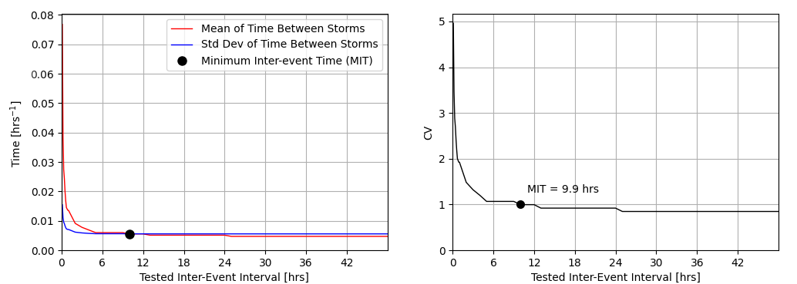
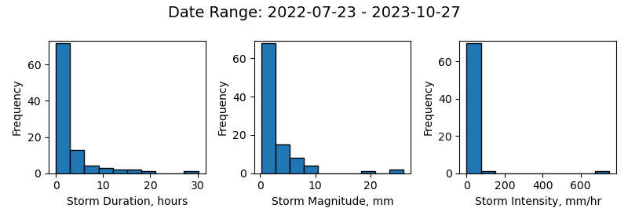
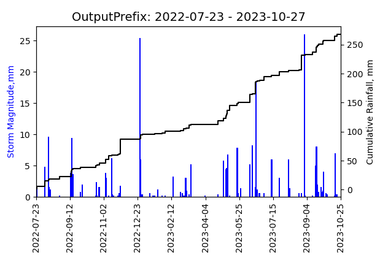
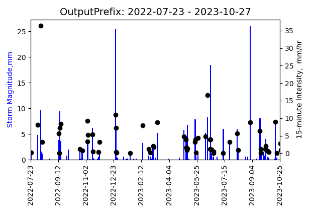
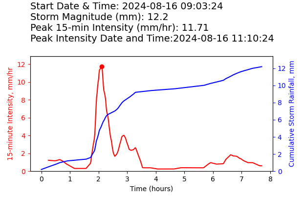

## Inputs

SEPARATE is designed to handle both common types of TBRG data records (fixed time interval or event-based logging). Users are simply required to select which record type they are inputting from a drop-down menu. The GUI also has required inputs for the equivalent rainfall depth of each tip along with the corresponding units (mm, cm, inches) - parameters specific to the make and model of TBRG.

Finally, users must browse to and select their input data file of unprocessed TBRG rainfall data. The selected file must be either a formatted Excel spreadsheet ('.xlsx') or comma-delimited text file ('.csv') that includes two columns of data assumed to have a single row of headers (though the header information is not read or used in any way in the analysis). 

For both record types, the first column must be the logged datetimes using slash delimiters for the date, colon delimiters for time, and formatted as 'MM/DD/YY HH:MM:SS'. For fixed interval loggers, the second column should include the cumulative rainfall recorded over the logging interval, while for event-based loggers, this column should include a cumulative count of the tips from the start of the record. The required datetime and logging data formatting is designed to be consistent with the tabular outputs from common commercially available TBRG loggers.

For users of Onset brand HOBO rain gauges and data loggers (e.g., HOBO RG3-M with pendant event logger or HOBO S-RGB-M002 with an external data logger), the SEPARATE manual provides instructions about how to set up the HOBOware preferences to default export TBRG records that are formatted exactly to the specifications necessary for SEPARATE, allowing for streamlined data processing.

## Partitioning Methods & Parameters

SEPARATE identifies and partitions storm events from continuous TBRG rainfall records using the fixed minimum inter-event time (MIT) approach; one of the, if not the most, common approaches for partitioning storm events. The underlying assumption in this approach is that whenever the period of time between two tips (the inter-event time) exceeds a pre-determined value (the MIT), then these two tips will be identified as belonging to separate storm events. Conversely, wherever the period of time between two tips is less than the fixed MIT, these tips will be identified as belonging to the same storm. While this analytical approach is, in and of itself, rather straightforward, the challenge lies in determining the most appropriate MIT value to use for the identification and separation of storm events. There are an untold number of criterion proposed for determining a fixed MIT value to separate storm events in continuous rainfall records, but SEPARATE provides options for users to analyze their TBRG data using two of the most common and widely employed criterion for determining a fixed MIT value (discussed below), as well as options to apply additional criteria to filter storms based on their event metrics.

The first criterion users may choose is a "user-defined MIT". With this option, users must define the fixed MIT (in hours) for SEPARATE to use for the separation and analysis of storm events. If selecting this option, users should carefully consider the intended application of their data, review any possible guidelines related to their analysis (e.g., regulatory standards), and consider the hydroclimatic region in which their rainfall data was collected, as this has been suggested to influence MIT values [@restrepo:1982]. We also recommend users conduct at least a basic sensitivity analysis to evaluate the influence of their defined MIT value on the resulting storm metrics (e.g., [@dunkerley:2008]; [@tiranti:2010]). Fixed MIT values can vary widely, with reported values ranging anywhere from a few minutes up to many days [@restrepo:1982; @dunkerley:2008], which is why users should carefully consider their selection. However, we note that for applications relying on the user-defined criterion, the most commonly reported MIT values when using this approach are 6 to 8 hours [@driscoll:1989; @palecki:2005; @dunkerley:2008; @staley:2017].

The second criterion users may choose from is the independent storm criterion, or the "independence criterion" as it is also sometimes called. The independence criterion is a statistical method first proposed by Restrepo-Posada & Eagleson [@restrepo:1982] for the determination of a fixed inter-event time for storm event separation that is designed to maximize the likelihood of identifying statistically independent events. The underlying assumption of this approach is that the inter-event times of storm events at any given TBRG location will behave as a stochastic Poisson process. In other words, all storms are considered independent probabilistic events with the timing of their arrival representing a completely random process. Based on this assumption of independence, the inter-event times of storms should follow an exponential distribution (\autoref{fig:FigureS1}).

![Example graphical output included when SEPARATE is run using the independent storm criterion. The graph includes the probability distribution of inter-storm times following event separation using the MIT that satisfies the recommended statistical test (CV = 1), overlaid with an exponential function that has an e-folding length equal to the inverse of the mean of inter-event times. This output provides users the opportunity to visually assess the validity of the assumption that the data in their rainfall record represents a Poisson process with completely random arrival times.\label{fig:FigureS1}](FigureS1.png)

 Determining the MIT value that meets this criterion is therefore accomplished by separating storm events in the record using a wide range of potential inter-event times (i.e., test intervals). Restrepo-Posada & Eagleson [@restrepo:1982] suggested that the appropriate MIT for identifying independent storms could be selected from amongst the tested intervals as the shortest interval at which the coefficient of variation (CV) of inter-event times is equal to one. Although perhaps less precise than performing a more rigorous statistical test, a CV = 1 is a characteristic property of an exponential distribution. As such, evaluation of the tested intervals for the independence criterion can be determined from calculations of the mean and standard deviation of the time between storms identified and separated based on each test interval (i.e., the distribution of inter-event times, or IET).

By default, SEPARATE tests inter-event intervals over a range of 0.1 to 48 hours, using a variable step size. The step size is set to 0.1 hours for test intervals between 0.1 to 1 hour and then increases to 1 hour for test intervals greater than 1 hour. None of the tested inter-event intervals are likely to produce a CV exactly equal to 1, thus SEPARATE performs a linear interpolation between the last test interval with a CV > 1 and the first test interval with CV < 1 to predict the MIT value where CV equals one (\autoref{fig:FigureS2}). Finally, recognizing that fixed MIT values are sometimes suggested to exceed 48 hours (though uncommon), the GUI also includes an option to allow users to increase the upper limit of the tested interval range. The upper value can be set to any integer value between 1 and 500 hours, but increasing this value above the default of 48 hours will increase SEPARATE's run time.

The final option in the Partitioning Criteria section of the GUI allows users to optionally apply and define additional criteria that suppress storms from the rainfall record based on a minimum threshold of storm duration and/or magnitude (i.e., total rainfall depth). For both of these criteria, the value input by the user represents the threshold that must be exceeded for a storm event to be included in the SEPARATE analysis. When analyzing data using a user-defined MIT, these additional criteria are only applied after event identification and separation and are then used to filter storms out of SEPARATE's outputs (both tabular and graphical). For the independent storm criterion, these additional criteria are applied during the statistical analysis used to determine the MIT value. Following the separation of events using each tested inter-event interval, storms that do not exceed either of the defined additional criteria are suppressed from the rainfall record, such that the corresponding inter-event period is assumed to be rainless [@balistrocchi:2011]. Importantly, this step occurs before the calculation of the mean and standard deviation of inter-event times between storms. Therefore, users should be aware that the inclusion of additional criteria when using the independent storm criterion may influence the MIT ultimately selected for storm identification and separation. For this reason, when SEPARATE is run with the independent storm criterion, additional outputs (both tabular and graphical) are included that detail the statistical results, including how many storms were included and potentially suppressed (if additional criteria were applied) under every tested inter-event interval (\autoref{fig:FigureS3}).

## Calculating Rainfall Metrics

Once a fixed MIT value is determined, either statistically or based on the user-defined input, SEPARATE then partitions storms in the rainfall record (\autoref{fig:FigureS4}A). For each identified storm, SEPARATE extracts the start time and end time, and then calculates the storm duration, total magnitude of rainfall, and the average storm intensity (\autoref{fig:FigureS4}B). All rainfall metrics reported by SEPARATE use the same units as the TBRG tips (mm, cm, or inches), and all rates, regardless of the duration over which they are calculated, are reported per hour. For example, if the tip units are in mm, then both the average storm intensity and the D-minute rainfall intensities will be reported in units of mm/hr. Additionally, for each identified and included storm, if there are at least 3 or more tips recorded in the storm, then SEPARATE will generate a cumulative rainfall profile using linear interpolation between each tip (\autoref{fig:FigureS4}). This rainfall profile is then densified to a 1-minute step interval for the purpose of calculating rainfall intensity (\autoref{fig:FigureS4}C).

Rainfall intensities, i.e. the rainfall rates measured over specified durations, are calculated in SEPARATE using a backward-differenced moving window applied over the 1-minute interval cumulative rainfall profile (\autoref{fig:FigureS4}D). Specifically, rainfall intensities are calculated as:
$$
iD(t) = \frac{R(t) - R(t - D)}{(D / 60)}, \quad D \leq t \leq T_s
$$
where $iD$ is the rainfall intensity [mm/hr] for a specified duration $D$ [minutes] (e.g., $i5$), $R(t)$ is the cumulative storm rainfall [mm] at the relative storm time $t$, interpolated at a 1-minute timestep. The backward-differenced moving window is applied from storm time, $t$, equal to the specified duration, $D$, through the end of the storm (i.e., the storm duration, $T_s$). SEPARATE will assess the 5-, 10-, 15-, 30-, and 60-minute duration rainfall intensities (reported as the $i5$, $i{10}$, $i{15}$, $i{30}$, and $i{60}$, respectively) for every storm, unless the storm duration is less than the intensity duration to be evaluated. For example, if there is a storm of a 20-minute duration, then SEPARATE will calculate the ${i5}$, $i{10}$, and $i{15}$ intensities, but not the $i{30}$ or $i{60}$. SEPARATE will then report the datetime and magnitude of the maximum ("peak") intensity for each calculated intensity duration in a given storm. Finally, users can select one intensity duration of interest, and SEPARATE will optionally include the full intensity profile (tabular and/or graphical) with the outputs.

![Conceptual example illustrating SEPARATE's core analytical steps, here based on a fixed interval TBRG rainfall record. These steps include: A) storm event identification using a fixed minimum inter-event time (MIT), B) the generation of the cumulative rainfall profile from the tipping bucket data, C) the densification of the cumulative rainfall profile to 1-minute timesteps for rainfall intensity analysis, and D) the application of a backward-differenced moving window over the 1-minute interval cumulative rainfall profile to generate a rainfall intensity profile of a given duration (with i5 shown) to determine the timing and magnitude of the peak in a given storm.](FigureS4.png) {width=80%}\label{fig:FigureS4}

## Output Options

SEPARATE's default outputs include a single Excel file and three image files. These files are all saved to a subfolder created within an output directory selected by the user in the GUI, and the output folder along with all associated files are named using a prefix entered by the user. 

The storm-based metrics for identified storms are written to the first sheet of the Excel file named '[OutputPrefix]_SummaryTable.xlsx'. The header of first sheet also includes detailed metadata about the original dataset and the SEPARATE parameters with the following fields and information:

| Field                                  | Description/Value                           |
|----------------------------------------|---------------------------------------------|
| Dataset ID                             | '[OutputPrefix]'                            |
| Record Start Date                      | 'YYYY-MM-DD'                                |
| Record End Date                        | 'YYYY-MM-DD'                                |
| Tipping Bucket Record Type             | '[Fixed Interval or Cumulative Tips]'       |
| Tip Magnitude                          | '[user input]'                              |
| Tip Units                              | '[user input]'                              |
| Logging Interval (min)                 | '[if fixed interval]'                       |
| Fixed MIT Selection Criterion          | '[user selection]'                          |
| Minimum Inter-Event Time (hours)       | '[criterion dependent]'                     |
| Total Number of Storms in Record       | 'XXX'                                       |
| Number of Storms Suppressed            | 'XXX'                                       |
| Minimum Storm Depth (mm)               | '[optional user input]'                     |
| Minimum Storm Duration (hrs)           | '[optional user input]'                     |
| Record Separated On                    | 'YYYY-MM-DD'                                |
| Data Input File                        | 'C:/… filepath'                             |

The summary table in the first Excel sheet then contains storm metrics for all identified storms (not including any suppressed based on optional user-defined additional criteria). This data table lists each storm in a separate row, with 16 attributes organized into columns with the following fields:

| Field              | Description                                                                                         |
|--------------------|-----------------------------------------------------------------------------------------------------|
| StormID            | auto-generated IDs formatted as: '[OutputPrefix]_YYYY-MM-DD' *(Note: if more than one storm per date, then ID receives additional suffix with storm number, e.g., '[OutputPrefix]_YYYY-MM-DD_2')* |
| Start              | date and time of first storm tip ('YYYY-MM-DD HH:MM:SS')                                            |
| End                | date and time of last storm tip ('YYYY-MM-DD HH:MM:SS')                                             |
| Duration           | storm duration (hours)                                                                              |
| Magnitude          | cumulative storm magnitude or total storm rainfall depth (TBRG tip units)                          |
| Storm_Intensity    | storm-averaged rainfall intensity, i.e., = magnitude/duration (TBRG tip units per hour)            |
| Peak_i5            | peak 5-minute storm intensity calculated with a moving window (TBRG tip units per hour)            |
| Peak_i10           | peak 10-minute storm intensity calculated with a moving window (TBRG tip units per hour)           |
| Peak_i15           | peak 15-minute storm intensity calculated with a moving window (TBRG tip units per hour)           |
| Peak_i30           | peak 30-minute storm intensity calculated with a moving window (TBRG tip units per hour)           |
| Peak_i60           | peak 60-minute storm intensity calculated with a moving window (TBRG tip units per hour)           |
| Peak_i5_time       | date and time of peak 5-minute storm intensity ('YYYY-MM-DD HH:MM:SS')                             |
| Peak_i10_time      | date and time of peak 10-minute storm intensity ('YYYY-MM-DD HH:MM:SS')                            |
| Peak_i15_time      | date and time of peak 15-minute storm intensity ('YYYY-MM-DD HH:MM:SS')                            |
| Peak_i30_time      | date and time of peak 30-minute storm intensity ('YYYY-MM-DD HH:MM:SS')                            |
| Peak_i60_time      | date and time of peak 60-minute storm intensity ('YYYY-MM-DD HH:MM:SS')                            |

Every analysis by SEPARATE also includes three output figures, saved as image files in a format selected by the user from a drop-down menu in the GUI ('.png', '.eps', '.jpg', or '.pdf'). These files are saved to the same output folder as the Excel file and use the same filename prefix. The three default figures include:

**Example Figure A**: Histograms displaying the distribution of storm durations, magnitudes, and average intensities of all identified storms in the rainfall record (*Filename:* '[OutputPrefix]_summary_plot').
  

**Example Figure B**: Timeseries plot of cumulative rainfall and storm magnitudes of all storms contained in the rainfall record (*Filename:* '[OutputPrefix]_magnitude_cumulative_rainfall_full').
 

 **Example Figure C**: Timeseries of the storm magnitudes (blue bars) and associated peak storm intensities (black scatter points) of a user-specified duration ('i5', 'i10', 'i15', 'i30', or 'i60') for all identified storms (*Filename:* '[OutputPrefix]_magnitude_rainfall_intensity_full'). *Note: Storms suppressed due to user-defined additional criteria (e.g., minimum storm depth) are not shown in the timeseries plots.*

Users can also optionally select (via checkboxes in the GUI) to output data and/or graphs of the cumulative rainfall and rainfall intensity profile (of a user-specified duration) for every identified storm. If that tabular data output option is selected, SEPARATE adds sheets to the Excel file, each containing the separated data from each storm event in the record with a sheet name corresponding to the storm ID identified in the summary table. Each storm data sheet includes the tip or interval datetimes, the cumulative storm time and rainfall, and the densified storm intensity profile of a user-specified duration ('i5', 'i10', 'i15', 'i30', or 'i60').

If the graphical output option is selected, SEPARATE outputs will also include graphical profiles for each identified storm event. These figures are all saved to a subfolder (named: '[OutputPrefix]_storm_plots') within the main outputs folder.

Each image file is named using its storm ID as the prefix and displays the cumulative rainfall profile (in blue) and rainfall intensity at the user-specified duration (in red), as well as annotations detailing the storm metrics. The peak storm intensity of the specified duration is identified in the graph with a red dot, and the associated time is noted in the annotations (\autoref{fig:FigureS5}).

{ width=80% }

## References
